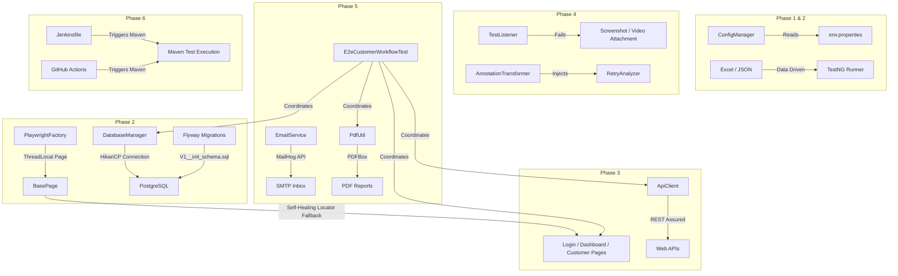

# Framework Architecture Specification (Phase-wise)

This document details the architectural design and structural growth of the **Enterprise Playwright Automation Framework** across its six implementation phases.

---

## 🏛️ Overall Architectural Flow

---

## 📅 Phase-wise Architectural Breakdown

### 🔧 Phase 1: Project Setup & Configuration Architecture
Phase 1 establishes the configuration boundaries and logging backbones, ensuring zero hardcoding of secrets and environment variables.

*   **Design Pattern**: Singleton Config Manager with System Property Override.
*   **Key Components**:
    *   `ConfigManager`: Loads properties dynamically from classpath (`src/main/resources/config/<env>.properties`). Prioritizes system level parameters (`-Dkey=value`) for dynamic overrides in Jenkins pipelines.
    *   `log4j2.xml`: Declares separate Console and Rolling File appenders. Exposes log throttling to mute verbose protocol logs from internal Netty or Playwright execution.
    *   `testng.xml`: Establishes parallelization at the `<test>` suite level with thread pools.

---

### 🚀 Phase 2: Engine, Drivers & Database Architecture
Phase 2 develops the execution engines.

*   **Design Pattern**: ThreadLocal Driver Isolation & Flyway Schema Migrations.
*   **Key Components**:
    *   `PlaywrightFactory`: Implements isolation for dynamic parallel browsers. Each execution thread owns an independent `Playwright`, `BrowserContext`, and `Page` wrapper, preventing thread collision during cross-browser execution.
    *   `DatabaseManager`: Utilizes HikariCP connection pooling to achieve high throughput and clean connection closures.
    *   `Flyway Migration Integration`: Programmatically executes SQL schemas (`db/migration/*.sql`) during DB initialization to maintain database state consistency.

---

### 🖥️ Phase 3: Page Object Model & API Client Architecture
Phase 3 builds the user interaction and endpoint interface layer.

*   **Design Pattern**: Page Object Model (POM) with **Advanced Locator Self-Healing Fallbacks**.
*   **Key Components**:
    *   `BasePage`: Provides high-level element interaction wrappers (safe clicks, inputs). Implements a sequential locator evaluation loop:
        $$\text{Selector List} = [\text{Primary Selector}, \text{Fallback CSS}, \text{Fallback XPath}, \text{Text}, \text{Role}]$$
        If a selector times out, the next selector heals the component and continues execution, logging warnings for developer visibility.
    *   `ApiClient`: Wraps REST Assured to support GET, POST, PUT, DELETE, PATCH requests. Automatically registers an `AllureRestAssured` filter to capture API requests/responses in reports.

---

### 📊 Phase 4: Test Infrastructure & Reporting Architecture
Phase 4 creates listeners to handle report bindings and test recovery.

*   **Design Pattern**: TestNG Listeners & Reflection-based Retry injections.
*   **Key Components**:
    *   `TestListener`: Implements `ITestListener`. Intercepts failures, inspects active thread states for Playwright pages, and calls `ScreenshotUtil` to attach full-page screenshots to the Allure report metadata.
    *   `RetryAnalyzer`: Implements `IRetryAnalyzer`. Automatically reruns failing test cases up to a threshold (e.g. 3 retries).
    *   `AnnotationTransformer`: Automatically registers `RetryAnalyzer` across all `@Test` annotations at runtime, removing compile-time boilerplates.

---

### 📩 Phase 5: Verification Services & E2E Integration
Phase 5 integrates specialized assertion utilities for complex data validations.

*   **Design Pattern**: API-driven SMTP Verification & PDF Document parsing.
*   **Key Components**:
    *   `EmailService`: Targets MailHog's API endpoints to retrieve emails programmatically, validating email recipients and utilizing Regex patterns to extract 6-digit OTP codes.
    *   `PdfUtil`: Employs Apache PDFBox to read binary PDF content and extract text strings. Includes a programmatic PDF generator to dynamically output mock report artifacts for local test loops.
    *   `E2eCustomerWorkflowTest`: Integrates UI forms, REST calls, PostgreSQL validation queries, and PDF download stream validations in a single unified flow.

---

### 🚀 Phase 6: DevOps & CI/CD Pipeline Architecture
Phase 6 configures continuous integration environments for pipeline execution.

*   **Design Pattern**: Native runner compilation and report archiving.
*   **Key Components**:
    *   `Jenkinsfile` & `maven.yml`: Orchestrate environment builds, install Playwright dependencies, execute TestNG suites, and archive screenshots, videos, and Allure report results.
